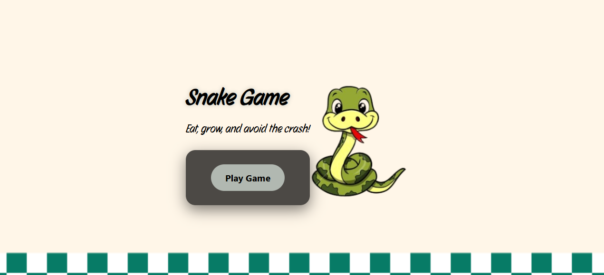
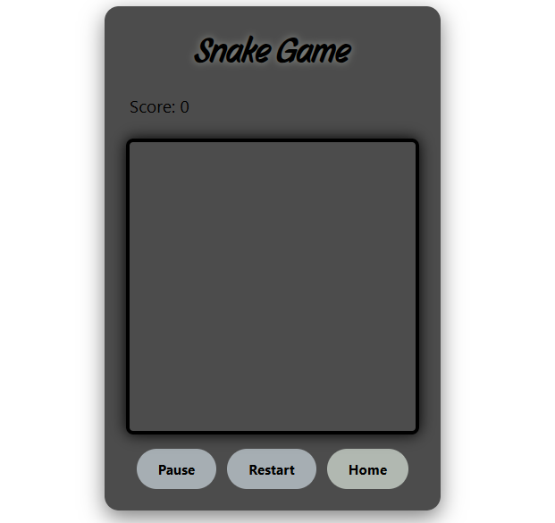

# Project One
## Date: 9/11/2025
### By: Mariam Abusari
#### [Website]() | [GitHub](https://github.com/mariamhassan333a-jpg) | [LinkedIn](https://www.linkedin.com/in/mariam-abusari-4458992b6?utm_source=share&utm_campaign=share_via&utm_content=profile&utm_medium=ios_app) | [Vettery]()
***

## **Description**
#### The Snake game where the player guides a snake around the screen. The snake moves and eats food to get longer, but it has to avoid hitting the walls or itself. The goal is to collect as much food as possible to earn points.
#### Every time the snake eats food, it becomes longer, which makes the game harder over time. The player uses the keyboard, like arrow keys or WASD, to control the snake’s movement. The game stops when the snake runs into the edge of the screen or hits its own body.
#####  To this game, you need to set up a loop that keeps the game running, handle player input, manage the snake’s movement and growth, check for collisions, and draw the game on the screen in real time.
***

### ***Technologies Used***
* HTML
* CSS
* JavaScript
***

### ***Getting Started***

##### The first page introduces the game with its name, a motivating message to encourage players,
##### and a prominent **Start Play** button to jump right into the action.
##### The project was deployed and can be viewed [here](https://snake_game01.surge.sh/).
***

### ***Screenshots***

##### image header 1

##### image header 2

***

### ***Future Updates***

- [ ] Skins & Customization
- [ ] Sound & Music
- [x] Varied Gameplay
- [x] Environmental Interaction
***

### ***Credits***

##### Help Codes : [SnakeGame Search](https://medium.com/@j0hnskot/how-to-make-a-snake-game-with-javascript-and-html-7c8c78b85873)

##### W3schools Guide: [Html DOM](https://www.w3schools.com/jsref/met_document_getelementbyid.asp)

##### Tutorials Games: [Tutorials & Notes](https://marina-ferreira.github.io/projects/)
***

